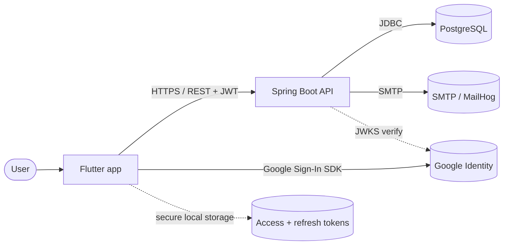
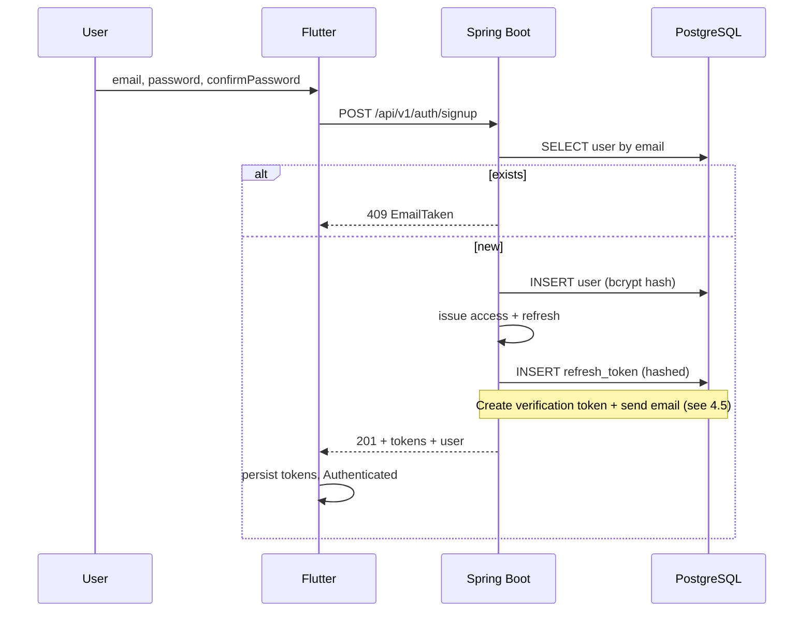
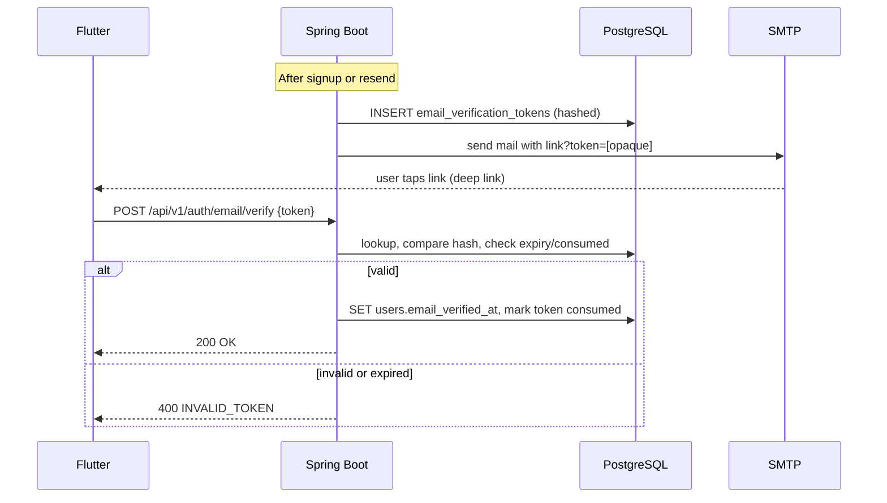
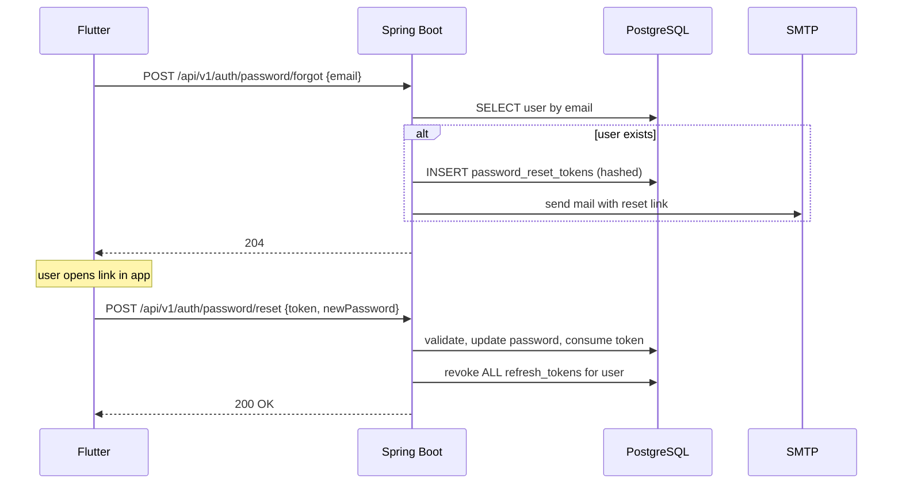
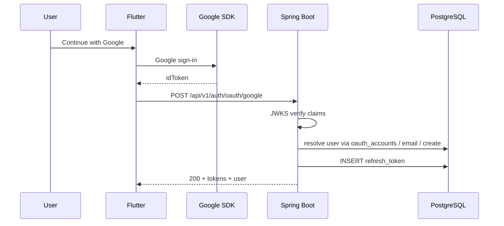
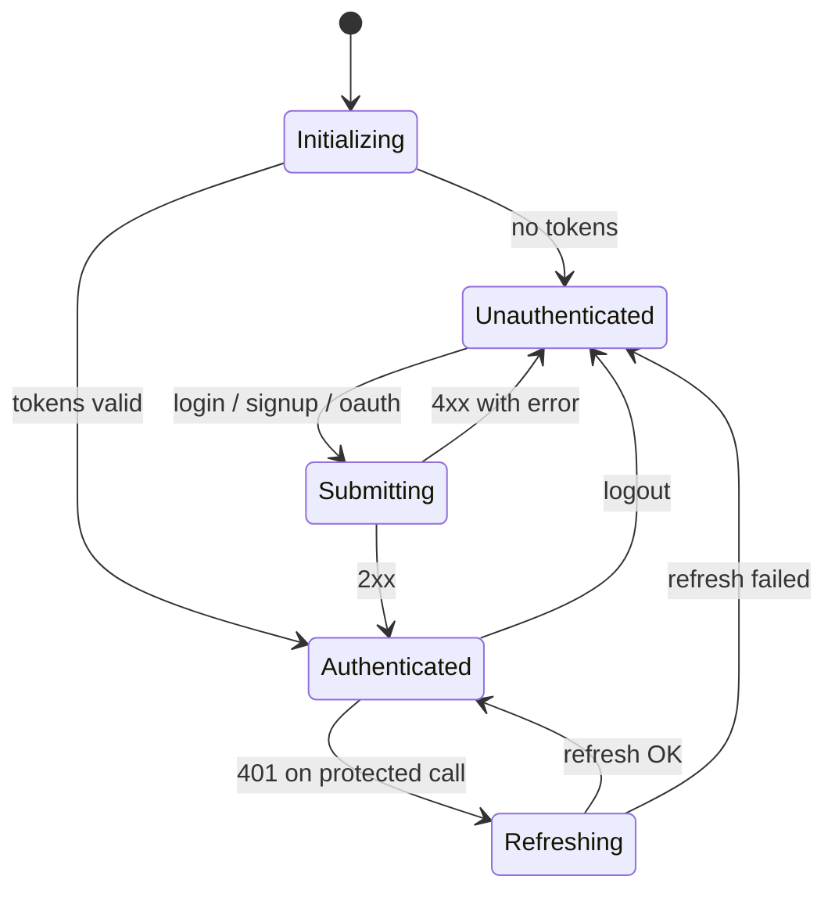

how to # Dyota Authentication — High-Level Design (HLD)

**Document version:** 0.8  
**Scope:** Authentication and account session for the Dyota Flutter app and Spring Boot API. Product catalog and orders are referenced only where they interact with auth (e.g. verified email before placing orders).

---

## 1. Goals and scope

### 1.1 In scope (V1)

- Sign up with **email** and **password** entered **twice** (password + confirmation). No required name at registration. The client **does not allow submit** until the two password fields match (and other field rules pass)—e.g. disabled primary action or equivalent—so the user does not “send and then find out.” The **API still rejects** mismatched `password` / `confirmPassword` on the wire (**400**) for tampered or non-app clients.
- Login and logout.
- JWT-based session: short-lived access token + long-lived refresh token (rotated).
- **Signed in vs signed out:** The user is either **signed in** (valid session) or **signed out**. There is no guest mode in the app.
  - **Signed out:** Only auth flows — login, sign up, forgot/reset password, and opening the verify-email link from email.
  - **Signed in:** Full app — browse, cart, addresses, orders list, etc.
- **`emailVerified`:** Separate flag on the user. After signup the user is **signed in** but may still have `emailVerified = false`. That is fine everywhere except **checkout / place order**: order and checkout APIs require `emailVerified = true` (403 otherwise); the app shows a verify-email prompt on checkout when needed.
- **Password reset** via email (forgot flow + deep link to set new password).
- **Social sign-in** with **Google** only for V1 (mobile: `google_sign_in` produces an ID token; API verifies via Google JWKS and issues our JWT pair). Other providers (e.g. Apple) are out of scope until explicitly added.

### 1.2 Out of scope (V1)

- Two-factor authentication (2FA).
- Account lockout after failed attempts (policy TBD later).
- Full audit logging (beyond minimal structured auth events).
- Rich account-merging UX (e.g. manual link wizard). Auto-linking rules are defined in section 7.
- OAuth / social providers other than **Google**.

### 1.3 Stated assumptions

| Area | Assumption |
|------|------------|
| Tenancy | Single-tenant Dyota storefront. |
| Backend | Java 21, Spring Boot 3, Spring Security, Spring Data JPA, Gradle. |
| Database | PostgreSQL (local or Docker). JDBC via `postgresql` driver. |
| Access token | JWT, HS256, ~15 min TTL, secret from env (`JWT_SECRET`, min 256-bit). |
| Refresh token | Opaque random, bcrypt-hashed in DB, ~30-day TTL, rotated on each refresh. |
| Passwords | `BCryptPasswordEncoder`, cost 12. |
| Email | Spring `JavaMailSender` over SMTP. Local dev: MailHog (SMTP 1025, UI 8025). Prod: env-configured relay. |
| Deep links | Production: Universal Links (iOS) / App Links (Android). Development: `dyota://` custom scheme. |
| App entry | No guest browse: main app is only reachable when **signed in**. |

---

## 2. System context

End users interact with the Flutter app. The app talks HTTPS + JSON to the API, uses provider SDKs for OAuth, stores our tokens locally, and receives verification/reset links that open the app. The API persists data in PostgreSQL and sends email via SMTP.

---

## 3. Component responsibilities

| Component | Responsibility |
|-----------|----------------|
| **Flutter client** | Auth UI, validation, `AuthRepository`, secure token storage, Dio + Bearer header, Riverpod auth state, `go_router` redirects, **Google** Sign-In SDK, deep-link handling for verify/reset. |
| **Spring Boot API** | Credential validation, password hashing, JWT issue/verify, refresh rotation and revocation, single-use tokens for verify/reset, transactional email, **Google** ID-token verification (JWKS). |
| **PostgreSQL** | Users, refresh tokens, email-verification tokens, password-reset tokens, OAuth account links. |
| **SMTP / MailHog** | Delivers verification and password-reset messages. |
| **Google Identity** | Issues signed ID tokens; API validates signatures and claims via JWKS. |

---

## 4. Behavioral flows

### 4.1 Sign up (password)

The user enters **email**, **password**, and **password confirmation**. The app keeps **submit disabled** until `password` equals `confirmPassword` (and email/password policy passes). Only then can the user trigger `POST /api/v1/auth/signup`. The server **still validates** equality of `password` and `confirmPassword` and returns **400** if they differ (clients that bypass the UI). On success the API creates the user (password hashed), issues tokens, persists refresh, and sends the first verification email (see §4.5).

**User in API responses:** In V1, auth and `/auth/me` return a user object with **`id`, `email`, and `emailVerified` only**. There is **no `name` field** in JSON (omit it entirely; do not send `"name": null`).

### 4.2 Login

Validate email + password. Return same token bundle as signup. **Generic 401** for failed login (no distinction between unknown email and wrong password), to reduce email enumeration. Optionally use one generic error `code` (e.g. `INVALID_CREDENTIALS`) and the same message for both cases.

### 4.3 Refresh

Client sends refresh token (and optionally token id if split). Server validates hash, expiry, revocation; issues new access + refresh; **revokes** the previous refresh row (rotation). If a **revoked** refresh is reused, optionally revoke all refresh tokens for that user (theft scenario; exact policy in implementation).

### 4.4 Logout

Client calls logout with Bearer access; server revokes the current refresh token (or all for device/session, depending on product choice). Client clears secure storage.

### 4.5 Email verification

Triggered after signup and on explicit **Resend**. Server creates a row in `email_verification_tokens` with a bcrypt hash of a random opaque token. Email contains a link whose query contains the **raw** token (never logged). User opens link; app calls verify endpoint.

After success, client should refresh session (or call `/me`) so the access token reflects `email_verified=true` if that claim is embedded in JWT.

### 4.6 Password reset

**Forgot:** always returns **204 No Content** whether or not the email exists, to reduce enumeration. If the user exists, create `password_reset_tokens` and send email.

**Reset:** client submits token from deep link + new password. On success: update password hash, mark token consumed, **revoke all refresh tokens** for that user (force re-login everywhere).

### 4.7 OAuth login (Google)

Mobile uses **Google Sign-In**. App sends `idToken` to `POST /api/v1/auth/oauth/google`. API fetches/caches Google JWKS, verifies signature, `iss`, `aud`, `exp`. Then:

1. If `oauth_accounts` has `(provider='google', subject)` → load linked user.
2. Else if email from token matches an existing user **and** Google asserts `email_verified` → insert `oauth_accounts` row and link.
3. Else create new user with `email_verified_at` set now (Google-verified email) and `oauth_accounts`.

Issue access + refresh as for password login.

---

## 5. Token strategy (summary)

| Token | Lifetime | Storage | Notes |
|-------|----------|---------|--------|
| Access JWT | ~15 min | Memory + secure storage (client) | Claims include `sub`, `email`, `email_verified`, `exp`, `typ=access`. |
| Refresh | ~30 days | Secure storage (client); hash in DB | Rotated each refresh; revoke on logout / password reset / theft policy. |
| Email verify | 24 h, single-use | Hash in DB; raw only in email URL | |
| Password reset | 30 min, single-use | Hash in DB; raw only in email URL | |
| Google ID token | Minutes | Not stored | Verified once; discarded after validation. |

---

## 6. Client auth state (conceptual)

At the shell level: **signed out** or **signed in**. `emailVerified` does not add a third “mode”; it only affects **checkout / place order** (see §1.1).

---

## 7. Security checklist

- Never log passwords, raw verification/reset tokens, or full JWTs in production.
- HTTPS + HSTS in non-local environments.
- Bcrypt for passwords and for refresh / verify / reset token **hashes at rest**.
- Login failures: **generic** error (same HTTP status and body shape for unknown email vs wrong password); same timing discipline where practical.
- Input validation: email; password rules; on **signup**, **password and confirmation must match before submit is allowed** (client); **server** still enforces equality on `POST /auth/signup` (**400** if bypassed).
- Forgot-password: always HTTP 204; add rate limits at gateway (per IP and per email) when available.
- OAuth (Google): enforce `iss`, `aud`, signature, `exp` against Google JWKS.
- Auto-link existing email to OAuth only if provider marks email verified; otherwise reject until password login or future linking flow.
- Prefer Universal Links / App Links for verify/reset in production; restrict `dyota://` to dev builds where possible.
- Rate-limit signup, login, verify, and resend endpoints (infra/deferred).

---

## 8. Non-functional requirements and observability

- **Latency:** Target under 300 ms p95 for login on a typical LAN to the API.
- **Logging (examples):** `auth.signup.success`, `auth.login.failure`, `auth.refresh.rotated`, `auth.logout`, `auth.email.verified`, `auth.password.reset.completed`, `auth.oauth.login.success{provider}`.
- **PII:** Log user id where needed; avoid full email in routine info logs.

---

## 9. Risks and open questions

- **JWT secret rotation:** Key versioning in tokens vs hard cutover (LLD / runbook).
- **Multi-device sessions:** Supported via multiple refresh rows; no “device list” UX in V1.
- **JWKS cache:** TTL and refresh on unknown `kid` after provider key rotation.
- **Tokens in URLs:** Short TTL + single use mitigates leak via referrers; prefer Universal Links.
- **Deep-link hijacking:** Mitigate with verified domain and HTTPS; custom scheme weaker in dev only.
- **Email deliverability:** SPF/DKIM/DMARC for production domain (ops).
- **Resend verification:** Throttle to prevent abuse and inbox spam.

---

## 10. Relation to product PRD

PRD browse/search for fabrics are satisfied **after sign-in** (no anonymous catalog in the app). Checkout still requires verified email as in §1.1.

---

## 11. Document history

| Version | Date | Notes |
|---------|------|--------|
| 0.1 | 2026-04-29 | Initial draft from architecture plan. |
| 0.2 | 2026-04-29 | Full-app auth wall (no guest browse). |
| 0.4 | 2026-04-29 | Social auth: **Google only**; Apple / other providers removed from V1 scope. |
| 0.5 | 2026-04-29 | Signup: **email + password** only (name not required at registration). |
| 0.6 | 2026-04-29 | Signup: **password + confirmation**; server rejects mismatch. |
| 0.7 | 2026-04-29 | User JSON: **no `name` property** in V1 (omit; never `null`). |
| 0.8 | 2026-04-29 | Signup: **submit gated** until password === confirmPassword; API check retained for bypass. |
