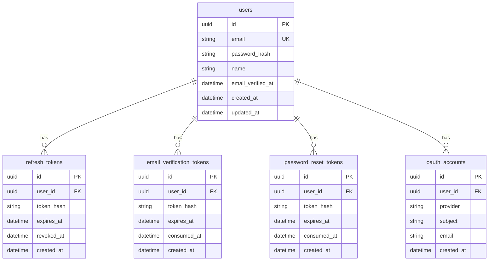

# Dyota Authentication — Low-Level Design (LLD)

**Document version:** 0.8  
**Companion:** [auth-hld.md](./auth-hld.md)

This document specifies file layout, contracts, API surface, schema, and configuration so engineering can implement consistently. It is not executable code.

---

## 1. Repository layout

```text
dyota/                          # Flutter app root (existing)
  lib/
  pubspec.yaml
  backend/                      # NEW — Spring Boot API (to be generated)
    build.gradle.kts
    settings.gradle.kts
    src/main/java/com/dyota/api/...
    src/main/resources/application.yml
    src/main/resources/db/migration/
    src/test/java/com/dyota/api/...
  docs/
    auth-hld.md
    auth-lld.md
```

---

## 2. Flutter application

### 2.1 Dependencies (add when implementing)

| Package | Role |
|---------|------|
| `flutter_riverpod` | Already in project; auth `AsyncNotifier`, DI |
| `dio` | HTTP + interceptors (Bearer, 401 → refresh) |
| `flutter_secure_storage` | Persist access + refresh tokens |
| `go_router` | Declarative routes, redirects, deep links |
| `freezed` + `freezed_annotation` + `json_annotation` | Immutable models |
| `json_serializable` + `build_runner` (dev) | JSON codegen |
| `google_sign_in` | Google ID token on mobile (**only** social provider in V1) |
| `app_links` | Universal Links, App Links, and custom scheme routing |

### 2.2 Directory and file map

```text
lib/
  main.dart
  app.dart
  core/
    config/                     # optional: env / flavor flags
    network/
      api_client.dart           # Dio base URL, timeouts, error mapping
      api_client_provider.dart
      auth_interceptor.dart     # attach Bearer; on 401 delegate to refresh
    storage/
      secure_storage.dart       # thin wrapper
      token_store.dart          # get/set/clear access + refresh (+ metadata if needed)
      token_store_provider.dart
    routing/
      app_router.dart           # GoRouter routes + redirect + initialLocation
  data/
    models/
      auth_user.dart            # @freezed — id, email, emailVerified (no name in V1 API)
      auth_tokens.dart          # @freezed — accessToken, refreshToken, refreshTokenId?
    repositories/
      auth_repository.dart
      auth_repository_impl.dart
      auth_repository_provider.dart
    sources/
      auth_api.dart             # REST calls matching section 3.2
      oauth_sign_in.dart        # google_sign_in → idToken for POST /auth/oauth/google
  features/
    auth/
      controllers/
        auth_controller.dart
        auth_state.dart
      screens/
        login_screen.dart
        signup_screen.dart
        forgot_password_screen.dart
        reset_password_screen.dart
        verify_email_screen.dart
        verify_email_callback_screen.dart
      widgets/
        email_field.dart
        password_field.dart
        confirm_password_field.dart   # signup: must match password
        auth_submit_button.dart          # signup: disabled until form valid (incl. password === confirmPassword)
        auth_error_banner.dart
        social_buttons.dart              # Google sign-in only in V1
        password_strength_meter.dart   # optional
```

### 2.3 State and repository contracts (Dart sketch)

States:

```dart
sealed class AuthState {}

class AuthInitializing extends AuthState {}

class AuthUnauthenticated extends AuthState {
  final String? message;
}

class AuthSubmitting extends AuthState {}

class AuthAuthenticated extends AuthState {
  final AuthUser user;
}

class AuthError extends AuthState {
  final String message;
}
```

Repository:

```dart
abstract class AuthRepository {
  Future<AuthUser> signup({
    required String email,
    required String password,
    required String confirmPassword,
  });

  Future<AuthUser> login({
    required String email,
    required String password,
  });

  /// V1: Google only (`google_sign_in` → `POST /auth/oauth/google`).
  Future<AuthUser> signInWithGoogle();

  Future<void> logout();

  /// Reads secure storage, optionally refreshes, returns user if session valid.
  Future<AuthUser?> restoreSession();

  /// Authenticated user: resend verification email (server identifies user from token if Bearer required).
  Future<void> requestEmailVerification();

  /// Consumes token from deep link.
  Future<void> confirmEmailVerification(String token);

  Future<void> forgotPassword(String email);

  Future<void> resetPassword({
    required String token,
    required String newPassword,
  });
}
```

Conventions:

- **Signup UX:** Primary submit is **disabled** until `password == confirmPassword` and validators pass; optional inline messages as the user types. **Do not** rely on “submit then show mismatch error” as the normal path.
- **`authControllerProvider`:** `AsyncNotifierProvider<AuthController, AuthState>` (or `NotifierProvider` if you prefer non-Async; team choice).
- **`AuthUser.emailVerified`:** Used only to block **checkout / place order** (see HLD §1.1), not general navigation.
- **Dio:** One `AuthInterceptor` that injects `Authorization: Bearer <access>`. On 401 from an authenticated request, serialize concurrent refresh (single-flight), call `POST /auth/refresh`, update `TokenStore`, replay request once; on failure clear storage and set `AuthUnauthenticated`.

### 2.4 Routing and guards

- **Signed out:** Only `/login`, `/signup`, `/forgot-password`, `/reset-password`, `/verify-email/callback?token=…`. Everything else redirects to login.
- **Signed in:** All app routes allowed. **`emailVerified == false`:** still signed in; only **checkout / place-order** is blocked (verify-email prompt + API 403 from orders domain).

**Deep links:** verify and reset URLs map to the callback/reset routes (see table below).

| Incoming | Maps to |
|----------|---------|
| `https://app.dyota.com/verify-email?token=...` | `/verify-email/callback?token=...` |
| `https://app.dyota.com/reset-password?token=...` | `/reset-password?token=...` |
| `dyota://...` (dev) | same |

Use `go_router` + `app_links`.

### 2.5 Flutter test plan

- **Widget:** Signup: primary submit **disabled** until `password == confirmPassword` (and validators pass); optional inline hints. Login validation; forgot-password neutral success.
- **Repository (mock Dio):** Signup parses `AuthResponse`, writes tokens via `TokenStore`.
- **Google sign-in:** Mock `oauth_sign_in.dart` to return a fixed idToken; assert `auth_api` calls `POST .../oauth/google` with that token.
- **Router:** Signed-out user opening any main route → login. Signed-in user with `emailVerified == false` blocked only at checkout / submit order.
- **Deep link:** Simulated URI opens callback route and invokes `confirmEmailVerification` with extracted token.

---

## 3. Spring Boot API

### 3.1 Technology

- Java 21, Spring Boot 3.x
- Spring Security (resource server style + custom JWT filter, or servlet filter + manual auth)
- Spring Data JPA + Hibernate
- Flyway for migrations
- `JJWT` or Nimbus for JWT; Nimbus for JWKS consumer
- `JavaMailSender` + SMTP
- Testcontainers (PostgreSQL) + GreenMail (optional) for integration tests

### 3.2 Package structure

```text
com.dyota.api
  DyotaApiApplication.java
  config/
    SecurityConfig.java
    JwtAuthenticationFilter.java
    CorsConfig.java
    GlobalExceptionHandler.java
    AppProperties.java                    # @ConfigurationProperties(prefix = "dyota")
  auth/
    web/
      AuthController.java
      dto/
        SignupRequest.java            # email, password, confirmPassword (server: reject if mismatch)
        LoginRequest.java
        RefreshRequest.java
        AuthResponse.java
        UserDto.java                  # id, email, emailVerified — **no `name` in V1 JSON**
        VerifyEmailRequest.java
        ResendVerificationRequest.java
        ForgotPasswordRequest.java
        ResetPasswordRequest.java
        OAuthLoginRequest.java            # idToken (Google only in V1)
    service/
      AuthService.java
      JwtService.java
      RefreshTokenService.java
      EmailVerificationService.java
      PasswordResetService.java
      OAuthService.java
    oauth/
      ProviderTokenVerifier.java
      GoogleTokenVerifier.java
      JwksCache.java
    email/
      EmailService.java
      EmailTemplates.java
    domain/
      User.java
      RefreshToken.java
      EmailVerificationToken.java
      PasswordResetToken.java
      OAuthAccount.java
    repository/
      UserRepository.java
      RefreshTokenRepository.java
      EmailVerificationTokenRepository.java
      PasswordResetTokenRepository.java
      OAuthAccountRepository.java
```

### 3.3 REST API contract

Base path: **`/api/v1`**

#### Auth

| Method | Path | Auth | Request body | Success | Error codes |
|--------|------|------|--------------|---------|-------------|
| POST | `/auth/signup` | None | `SignupRequest` | 201 `AuthResponse` | 400 (validation / **password mismatch**), 409 |
| POST | `/auth/login` | None | `LoginRequest` | 200 `AuthResponse` | 400, 401 |
| POST | `/auth/refresh` | None | `RefreshRequest` | 200 `AuthResponse` | 401 |
| POST | `/auth/logout` | Bearer | optional body: current refresh id | 204 | 401 |
| GET | `/auth/me` | Bearer | — | 200 `UserDto` | 401 |

#### Email

| Method | Path | Auth | Request body | Success | Error codes |
|--------|------|------|--------------|---------|-------------|
| POST | `/auth/email/verify` | None | `VerifyEmailRequest` `{ "token": "..." }` | 200 | 400 |
| POST | `/auth/email/resend` | Bearer **or** body with email for pre-login edge case | `ResendVerificationRequest` | 204 | 400, 401 |

**Recommendation:** Prefer Bearer for resend when user is logged in; if you support email-only resend for logged-out users, rate-limit aggressively and consider requiring captcha later.

#### Password

| Method | Path | Auth | Request body | Success | Error codes |
|--------|------|------|--------------|---------|-------------|
| POST | `/auth/password/forgot` | None | `ForgotPasswordRequest` | **204 always** | — |
| POST | `/auth/password/reset` | None | `ResetPasswordRequest` | 200 | 400 |

#### OAuth

| Method | Path | Auth | Request body | Success | Error codes |
|--------|------|------|--------------|---------|-------------|
| POST | `/auth/oauth/google` | None | `OAuthLoginRequest` | 200 `AuthResponse` | 400, 401 |

#### Response and error envelope

`AuthResponse` / `UserDto` — **V1 JSON shape** (`name` is not part of the contract; do not include the key):

```json
{
  "accessToken": "eyJ...",
  "refreshToken": "opaque-or-jwt-per-impl",
  "refreshTokenId": "uuid-if-returned",
  "user": {
    "id": "uuid",
    "email": "user@example.com",
    "emailVerified": false
  }
}
```

Error:

```json
{
  "code": "EMAIL_TAKEN",
  "message": "Email already registered"
}
```

Example signup validation (primarily for **forged** requests; happy path blocked in UI):

```json
{
  "code": "PASSWORD_MISMATCH",
  "message": "Password and confirmation do not match"
}
```

`GlobalExceptionHandler` maps domain exceptions to HTTP status + `code`.

### 3.4 Security configuration notes

- **Stateless** HTTP sessions (`STATELESS`).
- **CSRF** disabled for REST API token usage.
- **Permit all** (no Bearer required):  
  `POST /api/v1/auth/signup`, `login`, `refresh`, `email/verify`, `password/forgot`, `password/reset`, `oauth/google`  
  Optional: `email/resend` if supporting unauthenticated resend (otherwise authenticated only).
- **All other** `/api/v1/**` routes require valid access JWT unless explicitly documented.
- **CORS:** allow Flutter web/dev origins via configuration.
- **Filter order:** `JwtAuthenticationFilter` after `UsernamePasswordAuthenticationFilter` (or replace with `OncePerRequestFilter`), populates `SecurityContext` with principal = user id (UUID string).

### 3.5 Database schema (PostgreSQL)

`UserDto` and all auth responses in V1 expose **`id`, `email`, `emailVerified` only**. The optional `users.name` column below is **not** included in REST JSON (omit the field; do not map to `null` in responses). It may be used internally later or dropped in a future migration.

Flyway migration: e.g. `V1__init_auth.sql`

```sql
CREATE TABLE users (
  id                UUID         NOT NULL PRIMARY KEY DEFAULT gen_random_uuid(),
  email             VARCHAR(255) NOT NULL UNIQUE,
  password_hash     VARCHAR(255) NULL,
  name              VARCHAR(120) NULL,
  email_verified_at TIMESTAMPTZ  NULL,
  created_at        TIMESTAMPTZ  NOT NULL DEFAULT NOW(),
  updated_at        TIMESTAMPTZ  NOT NULL DEFAULT NOW()
);

CREATE TABLE refresh_tokens (
  id         UUID         NOT NULL PRIMARY KEY DEFAULT gen_random_uuid(),
  user_id    UUID         NOT NULL REFERENCES users(id) ON DELETE CASCADE,
  token_hash VARCHAR(255) NOT NULL,
  expires_at TIMESTAMPTZ  NOT NULL,
  revoked_at TIMESTAMPTZ  NULL,
  created_at TIMESTAMPTZ  NOT NULL DEFAULT NOW()
);
CREATE INDEX ix_refresh_tokens_user ON refresh_tokens(user_id);

CREATE TABLE email_verification_tokens (
  id          UUID         NOT NULL PRIMARY KEY DEFAULT gen_random_uuid(),
  user_id     UUID         NOT NULL REFERENCES users(id) ON DELETE CASCADE,
  token_hash  VARCHAR(255) NOT NULL,
  expires_at  TIMESTAMPTZ  NOT NULL,
  consumed_at TIMESTAMPTZ  NULL,
  created_at  TIMESTAMPTZ  NOT NULL DEFAULT NOW()
);
CREATE INDEX ix_email_verification_tokens_user ON email_verification_tokens(user_id);

CREATE TABLE password_reset_tokens (
  id          UUID         NOT NULL PRIMARY KEY DEFAULT gen_random_uuid(),
  user_id     UUID         NOT NULL REFERENCES users(id) ON DELETE CASCADE,
  token_hash  VARCHAR(255) NOT NULL,
  expires_at  TIMESTAMPTZ  NOT NULL,
  consumed_at TIMESTAMPTZ  NULL,
  created_at  TIMESTAMPTZ  NOT NULL DEFAULT NOW()
);
CREATE INDEX ix_password_reset_tokens_user ON password_reset_tokens(user_id);

CREATE TABLE oauth_accounts (
  id         UUID         NOT NULL PRIMARY KEY DEFAULT gen_random_uuid(),
  user_id    UUID         NOT NULL REFERENCES users(id) ON DELETE CASCADE,
  provider   VARCHAR(32)  NOT NULL,  -- V1: 'google' only; column kept for future providers
  subject    VARCHAR(255) NOT NULL,
  email      VARCHAR(255) NULL,
  created_at TIMESTAMPTZ  NOT NULL DEFAULT NOW(),
  CONSTRAINT uq_oauth_provider_subject UNIQUE (provider, subject)
);
CREATE INDEX ix_oauth_accounts_user ON oauth_accounts(user_id);
```

**ER diagram:**



**JPA notes:**

- `User.passwordHash` nullable for OAuth-only accounts; password login disabled until password set (future feature) or user always uses OAuth.
- Use `UUID` as primary key type; PostgreSQL maps it natively via Hibernate.

### 3.6 Configuration (`application.yml` skeleton)

```yaml
spring:
  datasource:
    url: jdbc:postgresql://localhost:5432/dyota
    username: ${DB_USER}
    password: ${DB_PASSWORD}
  jpa:
    hibernate:
      ddl-auto: validate
    properties:
      hibernate:
        dialect: org.hibernate.dialect.PostgreSQLDialect
  flyway:
    enabled: true
  mail:
    host: ${SMTP_HOST:localhost}
    port: ${SMTP_PORT:1025}
    username: ${SMTP_USER:}
    password: ${SMTP_PASSWORD:}
    properties:
      mail:
        smtp:
          auth: ${SMTP_AUTH:false}
          starttls:
            enable: ${SMTP_TLS:false}

dyota:
  jwt:
    secret: ${JWT_SECRET}
    access-ttl: 15m
    refresh-ttl: 30d
  email:
    from: ${MAIL_FROM:no-reply@dyota.local}
    verification-ttl: 24h
    reset-ttl: 30m
    base-url: ${APP_BASE_URL:https://app.dyota.com}
  oauth:
    google:
      audience: ${GOOGLE_CLIENT_ID}
```

Environment variables (document in deployment README):

- `DB_USER`, `DB_PASSWORD`, `JWT_SECRET`, `SMTP_*`, `MAIL_FROM`, `APP_BASE_URL`, `GOOGLE_CLIENT_ID`

### 3.7 Backend test plan

- **Unit:** `JwtService` (sign, verify, expiry, wrong signature). `GoogleTokenVerifier` with mocked JWKS: happy path, wrong `aud`, expired, invalid signature.
- **Integration (Testcontainers PostgreSQL):** Full signup/login/refresh/logout; **API** rejects mismatched `password` / `confirmPassword` with **400** (simulated non-app client); duplicate signup 409; wrong password / unknown email on login → **401** (generic credentials failure); refresh rotation; revoked refresh reuse policy; email verify updates `email_verified_at`; forgot always 204; reset revokes all refresh tokens; Google sign-in creates user and oauth row.
- **Web slice:** Validation errors return 400 + `code`.
- **Email:** GreenMail or Testcontainers SMTP: asserts HTML/text contains link with **masked** logging (no token in logs).

---

## 4. Cross-cutting

- **API versioning:** `/api/v1` prefix; breaking changes bump version.
- **Clock:** Server UTC for all `*_at` fields; clients display in local time.
- **Logging:** Structured JSON; correlation id middleware (future).

---

## 5. Implementation order (suggested)

1. Backend: users, JWT, refresh, signup, login, me, migrations.
2. Flutter: Dio, storage, repository, login/signup/logout, router guard.
3. Email verification: server tokens + MailHog + Flutter verify screens + deep links.
4. Password reset: server + Flutter forgot/reset + deep links.
5. Google sign-in: JWKS verifier + `oauth_accounts` + Flutter button.
6. Hardening: rate limits, metrics, E2E tests.

---

## 6. Document history

| Version | Date | Notes |
|---------|------|--------|
| 0.1 | 2026-04-29 | Initial draft from architecture plan. |
| 0.2 | 2026-04-29 | Full-app auth wall in routing section. |
| 0.4 | 2026-04-29 | Social auth: **Google only**; Apple removed from V1. |
| 0.5 | 2026-04-29 | Signup: **email + password** only. |
| 0.6 | 2026-04-29 | Signup: **password + confirmation** field; API validates match. |
| 0.7 | 2026-04-29 | User JSON: **no `name` key** in V1 (omit entirely). |
| 0.8 | 2026-04-29 | Signup: **submit gated** until passwords match; server check for bypass only. |
